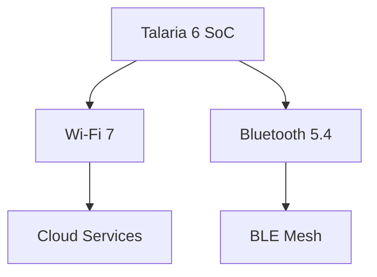

# Introduction
Welcome to the technical documentation for the Talaria-6 (T6), the world’s lowest power Wi-Fi + BLE modules.

| Category | Details |
| :--- | :--- |
| Wireless (Wi-Fi 7) | High-speed connectivity |
| Bluetooth 5.4 | Low-energy peripheral support |

---

### Advanced HTML Table (Replicated)
<table>
  <tr>
    <th>Category</th>
    <th>Details</th>
  </tr>
  <tr>
    <td rowspan="2">Wireless</td>
    <td>Wi-Fi 7</td>
  </tr>
  <tr>
    <td>Bluetooth 5.4</td>
  </tr>
</table>

### Mermaid Diagram Test

