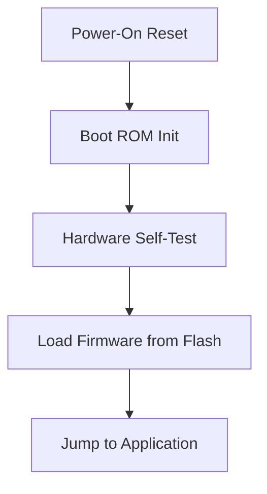

# Application Processor Subsystem

## Overview

The Application Processor Subsystem (APS) provides a high-performance computing environment for running complex application logic alongside the wireless communication stack.

## Architecture

The APS consists of the following major components:

- **ARM Cortex-M series CPU**: Efficient processing for embedded applications.
- **Tightly Coupled Memory (TCM)**: Low-latency memory for critical code and data.
- **DMA Controller**: Offloads data transfer tasks from the CPU.
- **Peripheral Bus Interface**: Connects to on-chip peripherals such as SPI, I2C, UART, and GPIO.

## Memory Map

| Region | Address Range | Size | Description |
|---|---|---|---|
| ROM | 0x0000_0000 – 0x0003_FFFF | 256 KB | Boot ROM |
| SRAM | 0x2000_0000 – 0x2007_FFFF | 512 KB | Application SRAM |
| TCM | 0x1000_0000 – 0x1000_FFFF | 64 KB | Tightly Coupled Memory |
| Peripherals | 0x4000_0000 – 0x4FFF_FFFF | — | Peripheral registers |

## Boot Sequence

1. Power-on reset initializes the APS.
2. Boot ROM performs hardware self-test.
3. Firmware image is loaded from flash into SRAM.
4. Control is transferred to the application entry point.

!!! tip
    Use the TCM region for interrupt handlers and real-time processing routines to minimize latency.
